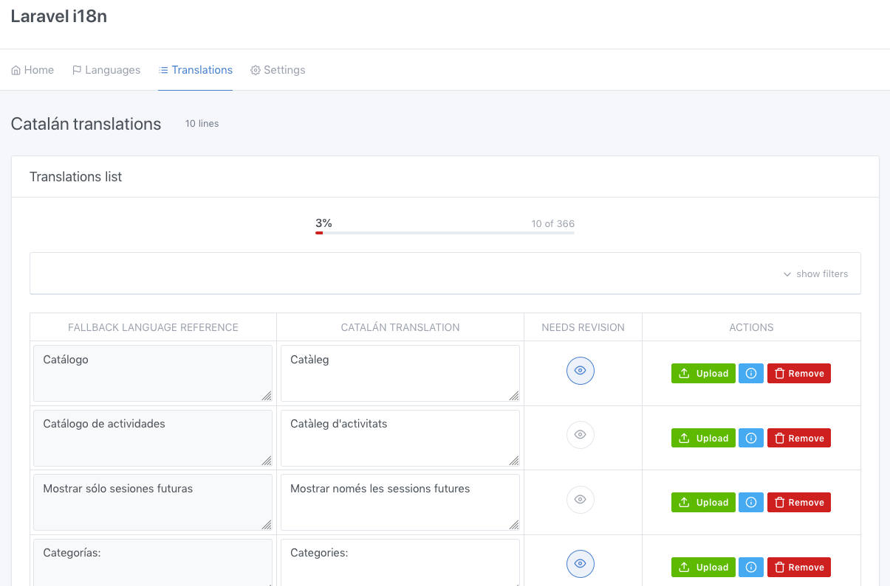

# laravel-i18n

[](https://travis-ci.com/jurios/laravel-i18n)

## What is this?
**laravel-i18n** is an alternative solution for deal with localization in Laravel
framework. It uses database as a way to store the translated texts and cache to
improve the efficiency.

### Features

* Deal with template translations and Model attribute translations as well.
* Your translations are persisted in database and cached in order to retrieve it faster.
* Automatically either new or edited translatable texts are detected and included.
* Web editor to manage languages and translations from your templates.




### Installation
```
composer require kodilab/laravel-i18n dev-master
``` 

This will install `laravel-i18n` and the dependencies that it needs.

Once you have `laravel-i18n` in your project, you must publish the assets/config files with:

```
php artisan vendor:publish --provider="Kodilab\LaravelI18n\I18nProvider"
php artisan vendor:publish --provider="Kodilab\LaravelFilters\QueryFilterProvider"
```

This will add `i18n.php` and `filters.php` config files to your `config` directory and some web editor assets in your 
`public/` folder. At this point, ignore `filters.php` config file. However, `i18n.php` should be checked over before
start using Laravel-i18n. As a three tables will be created in your database, check the names of these tables in the
config file in order to avoid collision names.

Laravel-i18n supports template translations and model translations as well. Obviously each one has their own flow thus
they has to been explained separately:

### Model Translations
For model translation, Laravel-i18n will create a specific table for each model which require translation. 
In this table translations will be persisted.
For do that, a migration file is the best place where start.

Being `car` a model **existing** in your project (thus, `cars` will be the name of table for this model), you can create
the translations table just like this:

**Important:** The translatable attributes must be defined in the translation table. If you define them in your model table they will be ignored by Laravel-i18n.

```(php)
public function up()
{
    i18n::generateModelI18nTable('cars', [
        'model' => 'string',
        'description' => 'text'
    ]);
}

public function down()
{
    i18n::dropIfExistsModelI18nTable('properties');
}
```
Here we are defining two attributes of cars -model and description- which they will be translatable. As a result, this migration
will create `cars_i18n` table with two columns (`model` and `description`). Each row in this table will be a translation in a different language
of these attributes. All things related with relationships between `cars` and `cars_i18n` has took place automatically.

Now, we have to add the logic needed by translations to our model `Car`. Just open the class `Car` and add the trait `Translatable`:

```(php)
use Kodilab\LaravelI18n\Translatable;

class Car extends Model
{
    ...
    use Translatable;
    ...
}
```

Now, we can access to the translation attributes as they were attributes of the model.

```
$car->model // Retrieve the translation of model
$car->description // Retrieve the translation of description
```
In this case the translation retrieved is for the language defined in the session (more info: TODO)

If we need a particular translation, then we can call this:
```(php)
$car->getTranslatedAttribute('model', Language::es()); //Retrieve the spanish translation for model
```

We can update our translations just with this:

```(php)
$car->updateTranslation(['model' => 'New text', ...], Language::es());
```

#### Add the laravel-i18n routes to your `web.php` file
In order to being the editor accessible, you should add the editor's routes in your `web.php` file.
You can place the `laravel-i18n` routes in the place you want in your routes with:

```
i18n::routes();
```

This allows you to add middlewares in order to authorization and authentification befores giving access to the `laravel-i18n` 
web pages.

This is an example:

```php
Route::group(['middleware' => 'custom_middleware'], function() {
    i18n::routes();
});
```

Now, if you call to `php artisan route:list` will see the new routes added to your list that they will be used 
by `laravel-i18n`.

You can start manage `laravel-i18n` with `/i18n` path.

#### Enabling your languages
There are 184 languages added which can use in `laravel-i18n`. However, you aren't going to use all of them. That's why
you need to enable only the languages that will be usable in your project. The disabled languages will be ignored by
`laravel-i18n`. You enable or disable languages when you want even if they have translations. The translations will keep
in database although you disable the language.

You can enable or disable languages in `laravel-i18n` settings visiting `i18n/settings/languages`. 

#### Start using the translation system

Now, every time your code calls to the function `t()`, the text provided will be a translatable text and you could manage
its translations through the web editor.

So, for example, if in your view has:
```
t('Hello world!')
```

This will be added as a translatable text and you could provide a translation for each language enabled in your platform.

The function `t()` has the a similar signature that laravel localization function `_()`:

```
function t(string $text, $replace = [], $locale = null, $honestly = false) 
```

* **$text**: Well, the text that will be translatable
* **$replace**: Equals as Laravel `_()`, you can use variables in your $text which it will be replaced by the values in 
$replaces. For example, this call `t('Hi, :name', ['name' => 'Jordi'])` will be translated as `Hi, Jordi` in English
or `Hola, Jordi` in Spanish.
* **$locale**: The language to be translated (using the ISO 639-1). You must use **enabled** language locales. 
Disabled languages will be ignored. When this value is `null`, this text will be translated dynamically depending 
on the settings. We'll see this on detail soon.
* **$honestly**: When `honestly` is `true` then `laravel-i18n` will be, well... honest. That means that when a 
translation can't be found for a specific language, then it will return an empty string `""`. When `honestly` is `false` 
then it will try to return a configured `fallback` language translation. We'll se more details about that soon.

Well, it's time to replace your texts in your code by calling to `t()` in every text.

#### (semi)Automatically translatable texts detection
The main reason why I created this package is because I didn't want to deal with translations manually. It's hard to 
maintain your translations files when you have to add a new entry in your `language.json` when you add a new text (specially 
when you are developing a project).

With this package it can automatically detect new texts and add new entries for your language translation. And there
are two ways to do it (and is recommended using both):

##### Static text detection
When you call to `php artisan i18n:sync`, it will synchronize your translatable texts in your code with your translations
in your database. It will delete the entries in your database which correspond to removed texts and it will add the new
texts. This is really useful specially when you are developing a view and you are modifying your texts frequently.

Is recommendend calling this function as frequently as you can just because it keeps your translations table up
to date with no manual work.

Yes, I know that are you thinking. Calling a artisan command doesn't look something atomatic. 
Yes, that's true. You can forget using it sometimes. Because of that, exists another alternative:

##### Dynamic text detection
Calling to `php artisan i18n:sync` is something that you can forget some times. In order to fix this, when someone 
renders a text that it should be translatable but is not added (because is not synchronized), then `laravel-i18n` 
do it for you. As a result, you will see this text in the web editor to add translations for each language.
The down side of this method is that a text has to be rendered before in order to be detected. Thus, texts which are rendered 
oddly will be unlikely listed. That's why you should use `php artisan i18n:sync` as frequently as you can.

### How it deals with locales
Mentioned before, Calling to `t()` with a defined `$locale` will translate the text to the Language's locale. 

```php
t('Hello world', null, 'es', null);
//Hola mundo
```

However, you can leave the `$locale = null` and `laravel-i18n` will use the Laravel's locale setting defined in your
`config/app.php` file.

```php
App::setLocale('es');
t('Hello world', null, null, null);
//Hola mundo

App::setLocale('ca');
t('Hello world', null, null, null);
//Hola món
```

If your project is multi language website and every user could use a different language, then you can change 
this setting every request depending on the variables you consider. For example, a way to deal with this is using 
this middleware sample: [setLocale.php](src/Middleware/SetLocale.php)

This middleware just look for the user's browser language preferences and it tries to look for the corresponding
enabled language in your database. If it exists, then it changes the Laravel locale to this new value. If it's not, 
then use the fallback language locale which is defined in `config/app.php` too.

### Honestly mode
As it is explained above, when you call `t()` with honestly mode activated it will return a blank text when a
translation doesn't exists for the `locale` defined.

This mode is deactivated by default. You have to add a `true` in the honestly argument to activate it. 
When it is deactivated, it will return the fallback language translation in case that a translation doesn't exist. 

As mentioned before, `fallback_locale` can be defined in your `config/app.php` file. This is the language that will 
be used as a `fallback`. The idea here is that your `fallback_locale` setting should be the same language used 
in your views texts. So, for example, if your texts in your views/code are written in English, your `fallback_locale` 
should be `en` (`en` is the ISO 639-1 for the English language). 
`Laravel-i18n` will consider the text in your view/code as the translation for the fallback language when it is detected
for the first time. Then, through the web editor, you can change the translation for this text.

That's why you will see that your `fallback_locale` language is always 100% translated.

**Be careful!:** your `fallback_locale` should be the ISO 639-1 of an **enabled** language. If it's not, an exception 
will be fired. You can call to `php artisan i18n:sync` after modify this value in order to enable it automatically if
it is necessary.
